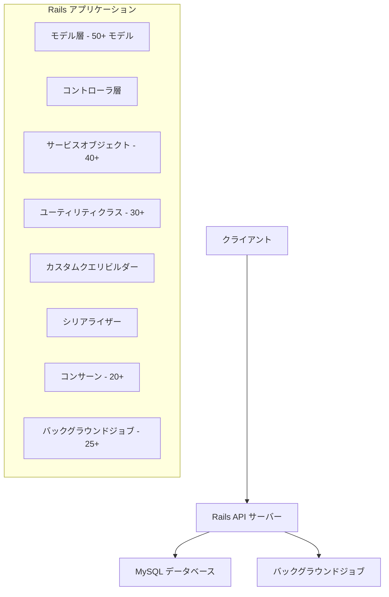

# Amazonクローン Railsアプリケーション実装計画

## 実装プロセス

### 作業分割計画

この実装計画を10の部分に分けて、段階的に実装していきます。各ステップに対応するチェックリストファイルを参照してください。

1. **プロジェクト初期設定** (01_project_setup.md)
   - Railsアプリケーション作成
   - データベース設定
   - ディレクトリ構造の拡張

2. **ユーザー関連モデル実装** (02_user_models.md)
   - User, Profile, Address, PaymentMethod, UserPreference, UserLog, UserDevice, UserSession, UserSubscription, UserReward, UserPermission, UserActivity

3. **商品関連モデル実装** (03_product_models.md)
   - Product, Category, SubCategory, Brand, ProductVariant, ProductAttribute, ProductImage, ProductVideo, ProductDocument, ProductDescription, ProductSpecification, PriceHistory, ProductBundle, ProductAccessory, ProductTag

4. **在庫・注文関連モデル実装** (04_inventory_order_models.md)
   - Inventory, Warehouse, StockMovement, InventoryAlert, InventoryForecast, SupplierOrder
   - Order, OrderItem, Payment, PaymentTransaction, Shipment, ShipmentTracking, Return, Invoice, OrderLog, OrderStatus, OrderDiscount, GiftWrap

5. **レビュー・マーケティング関連モデル実装** (05_review_marketing_models.md)
   - Review, Rating, Question, Answer, ReviewImage, ReviewVote
   - Promotion, PromotionRule, Coupon, Discount, Campaign, Advertisement, AffiliateProgram, ReferralProgram

6. **セラー・その他モデル実装** (06_seller_other_models.md)
   - Seller, SellerRating, SellerProduct, SellerDocument, SellerTransaction, SellerPolicy, SellerPerformance
   - Notification, SearchHistory, RecentlyViewed, Wishlist, Cart, CartItem, Tag, Tagging, Event, EventLog, SystemConfig, Currency, Country, Region

7. **コントローラ実装** (07_controllers.md)
   - 基本コントローラ（各モデルに対応）
   - 特殊コントローラ（Search, Recommendation, Checkout, Analytics, Report, BulkOperation, ImportExport, Webhook, HealthCheck, Metrics）

8. **サービスオブジェクト実装** (08_services.md)
   - 認証関連、商品関連、注文関連、在庫関連、ユーザー関連、その他

9. **カスタムクラス・モジュール実装** (09_custom_classes.md)
   - ユーティリティ、クエリビルダー、シリアライザー、エラーハンドリング、その他

10. **バックグラウンドジョブ・コンサーン・バリデーター実装** (10_background_jobs_concerns_validators.md)
    - メール関連、処理関連、データ処理、メンテナンス、その他
    - モデルコンサーン、コントローラコンサーン
    - カスタムバリデーター

### 進め方

1. 各ステップのチェックリストファイル（01_project_setup.md など）を参照して作業を進めてください
2. 各項目を実装したら、チェックリストにチェックを入れてください
3. ステップが完了したら、対応するチェックリストファイルを `completed` フォルダに移動してください
4. 次のステップに進んでください

### 進捗管理

- 現在作業中のチェックリストファイルは、ルートディレクトリに保持してください
- 完了したチェックリストファイルは、`completed` フォルダに移動してください
- これにより、どのステップまで完了したかが視覚的に分かりやすくなります

### 最終確認

全てのステップが完了したら、以下の点を確認してください：

1. すべてのチェックリストファイルが `completed` フォルダに移動されていること
2. アプリケーションが正常に動作すること
3. コード行数が目標の10000行を達成していること
4. テストが正常にパスすること

この実装計画に従って作業を進めることで、大規模なRails APIアプリケーションを効率的に構築することができます。

## 実装指示

1. **実装はこのファイルを参考にすること**：このファイルには全体の実装計画が記載されています。詳細な仕様や設計情報はここを参照してください。

2. **分割されたファイルを参考に実装し、完了次第completedフォルダに移動すること**：
   - 01_project_setup.md から順番に作業を進めてください
   - 各ステップが完了したら、対応するファイルをcompletedフォルダに移動してください
   - これにより、進捗状況を視覚的に管理できます

## 基本情報

- **Rails バージョン**: 最新版（7.x）
- **データベース**: MySQL
- **アプリケーションタイプ**: APIサーバー（ビューなし）
- **目標**: 外部ライブラリやフレームワークなしで10000行のコード

## 全体アーキテクチャ



## 詳細計画

### 1. プロジェクト初期設定

#### Railsアプリケーション作成
```bash
rails new rails-amazon --api --database=mysql --skip-test --skip-system-test
cd rails-amazon
```

#### データベース設定
```ruby
# config/database.yml
default: &default
  adapter: mysql2
  encoding: utf8mb4
  pool: <%= ENV.fetch("RAILS_MAX_THREADS") { 5 } %>
  username: root
  password:
  socket: /tmp/mysql.sock

development:
  <<: *default
  database: rails_amazon_development

test:
  <<: *default
  database: rails_amazon_test

production:
  <<: *default
  database: rails_amazon_production
  username: rails_amazon
  password: <%= ENV['rails_AMAZON_DATABASE_PASSWORD'] %>
```

#### ディレクトリ構造の拡張
```bash
mkdir -p app/services
mkdir -p app/serializers
mkdir -p app/utils
mkdir -p app/validators
mkdir -p app/queries
```

### 2. モデル設計（50+ モデル）

#### ユーザー関連（12モデル）
- **User**（認証情報、基本情報）
  ```ruby
  create_table "users", force: :cascade do |t|
    t.string "email", null: false
    t.string "password_digest", null: false
    t.string "first_name"
    t.string "last_name"
    t.string "phone_number"
    t.boolean "active", default: true
    t.datetime "last_login_at"
    t.string "reset_password_token"
    t.datetime "reset_password_sent_at"
    t.integer "failed_attempts", default: 0
    t.datetime "locked_at"
    t.timestamps
  end
  ```

- **Profile**（詳細プロフィール情報）
  ```ruby
  create_table "profiles", force: :cascade do |t|
    t.bigint "user_id", null: false
    t.date "birth_date"
    t.string "gender"
    t.text "bio"
    t.string "avatar"
    t.string "website"
    t.string "occupation"
    t.string "company"
    t.timestamps
    t.index ["user_id"], name: "index_profiles_on_user_id"
  end
  ```

- **Address**（住所情報、複数保持可能）
  ```ruby
  create_table "addresses", force: :cascade do |t|
    t.bigint "user_id", null: false
    t.string "address_type"
    t.string "name"
    t.string "address_line1", null: false
    t.string "address_line2"
    t.string "city", null: false
    t.string "state"
    t.string "postal_code", null: false
    t.string "country", null: false
    t.string "phone_number"
    t.boolean "is_default", default: false
    t.timestamps
    t.index ["user_id"], name: "index_addresses_on_user_id"
  end
  ```

- **PaymentMethod**（支払い方法、複数保持可能）
  ```ruby
  create_table "payment_methods", force: :cascade do |t|
    t.bigint "user_id", null: false
    t.string "payment_type", null: false
    t.string "provider"
    t.string "account_number"
    t.string "expiry_date"
    t.string "name_on_card"
    t.boolean "is_default", default: false
    t.timestamps
    t.index ["user_id"], name: "index_payment_methods_on_user_id"
  end
  ```

- **UserPreference**（設定、通知設定など）
  ```ruby
  create_table "user_preferences", force: :cascade do |t|
    t.bigint "user_id", null: false
    t.boolean "email_notifications", default: true
    t.boolean "sms_notifications", default: false
    t.boolean "push_notifications", default: true
    t.string "language", default: "en"
    t.string "currency", default: "USD"
    t.string "timezone", default: "UTC"
    t.boolean "two_factor_auth", default: false
    t.timestamps
    t.index ["user_id"], name: "index_user_preferences_on_user_id"
  end
  ```

- **UserLog**（ユーザーアクション履歴）
  ```ruby
  create_table "user_logs", force: :cascade do |t|
    t.bigint "user_id", null: false
    t.string "action", null: false
    t.string "ip_address"
    t.string "user_agent"
    t.text "details"
    t.timestamps
    t.index ["user_id"], name: "index_user_logs_on_user_id"
  end
  ```

- **UserDevice**（デバイス情報）
  ```ruby
  create_table "user_devices", force: :cascade do |t|
    t.bigint "user_id", null: false
    t.string "device_type"
    t.string "device_token"
    t.string "os_version"
    t.string "app_version"
    t.datetime "last_used_at"
    t.boolean "is_active", default: true
    t.timestamps
    t.index ["user_id"], name: "index_user_devices_on_user_id"
  end
  ```

- **UserSession**（セッション情報）
  ```ruby
  create_table "user_sessions", force: :cascade do |t|
    t.bigint "user_id", null: false
    t.string "token", null: false
    t.datetime "expires_at", null: false
    t.string "ip_address"
    t.string "user_agent"
    t.boolean "is_active", default: true
    t.timestamps
    t.index ["user_id"], name: "index_user_sessions_on_user_id"
    t.index ["token"], name: "index_user_sessions_on_token", unique: true
  end
  ```

- **UserSubscription**（サブスクリプション情報）
  ```ruby
  create_table "user_subscriptions", force: :cascade do |t|
    t.bigint "user_id", null: false
    t.string "plan_name", null: false
    t.decimal "price", precision: 10, scale: 2, null: false
    t.string "billing_cycle"
    t.datetime "start_date", null: false
    t.datetime "end_date"
    t.boolean "auto_renew", default: true
    t.string "status", null: false
    t.timestamps
    t.index ["user_id"], name: "index_user_subscriptions_on_user_id"
  end
  ```

- **UserReward**（報酬情報）
  ```ruby
  create_table "user_rewards", force: :cascade do |t|
    t.bigint "user_id", null: false
    t.string "reward_type", null: false
    t.integer "points"
    t.decimal "amount", precision: 10, scale: 2
    t.datetime "expires_at"
    t.boolean "is_used", default: false
    t.timestamps
    t.index ["user_id"], name: "index_user_rewards_on_user_id"
  end
  ```

- **UserPermission**（権限情報）
  ```ruby
  create_table "user_permissions", force: :cascade do |t|
    t.bigint "user_id", null: false
    t.string "resource", null: false
    t.string "action", null: false
    t.boolean "allowed", default: true
    t.timestamps
    t.index ["user_id"], name: "index_user_permissions_on_user_id"
  end
  ```

- **UserActivity**（アクティビティ履歴）
  ```ruby
  create_table "user_activities", force: :cascade do |t|
    t.bigint "user_id", null: false
    t.string "activity_type", null: false
    t.text "description"
    t.string "ip_address"
    t.timestamps
    t.index ["user_id"], name: "index_user_activities_on_user_id"
  end
  ```

#### 商品関連（15モデル）
- **Product**（基本情報）
  ```ruby
  create_table "products", force: :cascade do |t|
    t.string "name", null: false
    t.text "short_description"
    t.decimal "price", precision: 10, scale: 2, null: false
    t.string "sku", null: false
    t.string "upc"
    t.string "manufacturer"
    t.bigint "brand_id"
    t.bigint "category_id"
    t.bigint "seller_id"
    t.boolean "is_active", default: true
    t.boolean "is_featured", default: false
    t.datetime "published_at"
    t.timestamps
    t.index ["brand_id"], name: "index_products_on_brand_id"
    t.index ["category_id"], name: "index_products_on_category_id"
    t.index ["seller_id"], name: "index_products_on_seller_id"
    t.index ["sku"], name: "index_products_on_sku", unique: true
  end
  ```

- **Category**（カテゴリ階層）
  ```ruby
  create_table "categories", force: :cascade do |t|
    t.string "name", null: false
    t.text "description"
    t.bigint "parent_id"
    t.integer "position"
    t.string "slug", null: false
    t.boolean "is_active", default: true
    t.timestamps
    t.index ["parent_id"], name: "index_categories_on_parent_id"
    t.index ["slug"], name: "index_categories_on_slug", unique: true
  end
  ```

- **SubCategory**（サブカテゴリ）
  ```ruby
  create_table "sub_categories", force: :cascade do |t|
    t.bigint "category_id", null: false
    t.string "name", null: false
    t.text "description"
    t.integer "position"
    t.string "slug", null: false
    t.boolean "is_active", default: true
    t.timestamps
    t.index ["category_id"], name: "index_sub_categories_on_category_id"
    t.index ["slug"], name: "index_sub_categories_on_slug", unique: true
  end
  ```

- **Brand**（ブランド情報）
  ```ruby
  create_table "brands", force: :cascade do |t|
    t.string "name", null: false
    t.text "description"
    t.string "logo"
    t.string "website"
    t.string "country_of_origin"
    t.integer "year_established"
    t.boolean "is_active", default: true
    t.timestamps
  end
  ```

- **ProductVariant**（サイズ、色などのバリエーション）
  ```ruby
  create_table "product_variants", force: :cascade do |t|
    t.bigint "product_id", null: false
    t.string "sku", null: false
    t.string "name"
    t.decimal "price", precision: 10, scale: 2
    t.decimal "compare_at_price", precision: 10, scale: 2
    t.string "color"
    t.string "size"
    t.string "material"
    t.string "style"
    t.decimal "weight", precision: 8, scale: 2
    t.boolean "is_active", default: true
    t.timestamps
    t.index ["product_id"], name: "index_product_variants_on_product_id"
    t.index ["sku"], name: "index_product_variants_on_sku", unique: true
  end
  ```

- **ProductAttribute**（商品属性）
  ```ruby
  create_table "product_attributes", force: :cascade do |t|
    t.bigint "product_id", null: false
    t.string "name", null: false
    t.string "value", null: false
    t.boolean "is_filterable", default: false
    t.boolean "is_searchable", default: false
    t.timestamps
    t.index ["product_id"], name: "index_product_attributes_on_product_id"
  end
  ```

- **ProductImage**（商品画像）
  ```ruby
  create_table "product_images", force: :cascade do |t|
    t.bigint "product_id", null: false
    t.bigint "product_variant_id"
    t.string "image_url", null: false
    t.string "alt_text"
    t.integer "position", default: 0
    t.boolean "is_primary", default: false
    t.timestamps
    t.index ["product_id"], name: "index_product_images_on_product_id"
    t.index ["product_variant_id"], name: "index_product_images_on_product_variant_id"
  end
  ```

- **ProductVideo**（商品動画）
  ```ruby
  create_table "product_videos", force: :cascade do |t|
    t.bigint "product_id", null: false
    t.string "video_url", null: false
    t.string "thumbnail_url"
    t.string "title"
    t.text "description"
    t.integer "position", default: 0
    t.timestamps
    t.index ["product_id"], name: "index_product_videos_on_product_id"
  end
  ```

- **ProductDocument**（商品ドキュメント）
  ```ruby
  create_table "product_documents", force: :cascade do |t|
    t.bigint "product_id", null: false
    t.string "document_url", null: false
    t.string "title"
    t.string "document_type"
    t.integer "position", default: 0
    t.timestamps
    t.index ["product_id"], name: "index_product_documents_on_product_id"
  end
  ```

- **ProductDescription**（詳細説明）
  ```ruby
  create_table "product_descriptions", force: :cascade do |t|
    t.bigint "product_id", null: false
    t.text "full_description", null: false
    t.text "features"
    t.text "care_instructions"
    t.text "warranty_info"
    t.text "return_policy"
    t.timestamps
    t.index ["product_id"], name: "index_product_descriptions_on_product_id"
  end
  ```

- **ProductSpecification**（仕様情報）
  ```ruby
  create_table "product_specifications", force: :cascade do |t|
    t.bigint "product_id", null: false
    t.string "name", null: false
    t.string "value", null: false
    t.string "unit"
    t.integer "position", default: 0
    t.timestamps
    t.index ["product_id"], name: "index_product_specifications_on_product_id"
  end
  ```

- **PriceHistory**（価格履歴）
  ```ruby
  create_table "price_histories", force: :cascade do |t|
    t.bigint "product_id", null: false
    t.bigint "product_variant_id"
    t.decimal "old_price", precision: 10, scale: 2, null: false
    t.decimal "new_price", precision: 10, scale: 2, null: false
    t.string "reason"
    t.timestamps
    t.index ["product_id"], name: "index_price_histories_on_product_id"
    t.index ["product_variant_id"], name: "index_price_histories_on_product_variant_id"
  end
  ```

- **ProductBundle**（商品バンドル）
  ```ruby
  create_table "product_bundles", force: :cascade do |t|
    t.string "name", null: false
    t.text "description"
    t.decimal "price", precision: 10, scale: 2, null: false
    t.decimal "discount_percentage", precision: 5, scale: 2
    t.datetime "start_date"
    t.datetime "end_date"
    t.boolean "is_active", default: true
    t.timestamps
  end
  ```

- **ProductAccessory**（アクセサリー関連）
  ```ruby
  create_table "product_accessories", force: :cascade do |t|
    t.bigint "product_id", null: false
    t.bigint "accessory_id", null: false
    t.boolean "is_required", default: false
    t.timestamps
    t.index ["product_id"], name: "index_product_accessories_on_product_id"
    t.index ["accessory_id"], name: "index_product_accessories_on_accessory_id"
  end
  ```

- **ProductTag**（商品タグ）
  ```ruby
  create_table "product_tags", force: :cascade do |t|
    t.bigint "product_id", null: false
    t.bigint "tag_id", null: false
    t.timestamps
    t.index ["product_id"], name: "index_product_tags_on_product_id"
    t.index ["tag_id"], name: "index_product_tags_on_tag_id"
  end
